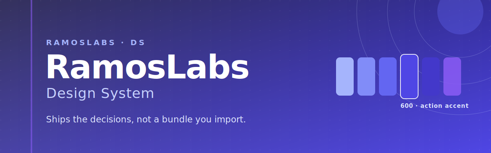

<div align="center">



### A mono-indigo, taxonomy-first design system that ships the decisions, not a bundle you import.

[](./CHANGELOG.md)
[](./LICENSE)
[](https://storybook.js.org/)
[](https://styledictionary.com/)

[Documentation](#what-you-get) · [Tokens](#using-the-design-tokens) · [Agentic layer](#the-agentic-layer) · [Quick start](#quick-start) · [Changelog](./CHANGELOG.md) · [Contributing](./CONTRIBUTING.md) · [License](#license)

</div>

---

RamosLabs DS is documentation-first. It is a guide and a doctrine for building a solid design system the RamosLabs way, not a component library you install and forget. The thesis is simple: it ships the decisions. You get a UI system you own, not a black-box dependency you pull in.

Tokens are the single source of truth. Color, spacing, typography, radius, shadow, and motion are defined once as design tokens and compiled to CSS variables and TypeScript. Nothing hardcodes a value, everything reads from the generated tokens.

<details>
<summary><strong>Table of contents</strong></summary>

- [The indigo ramp](#the-indigo-ramp)
- [What you get](#what-you-get)
- [The agentic layer](#the-agentic-layer)
- [Quick start](#quick-start)
- [Using the design tokens](#using-the-design-tokens)
- [Repository structure](#repository-structure)
- [Roadmap](#roadmap)
- [Versioning](#versioning)
- [Contributing](#contributing)
- [License](#license)
- [Credits](#credits)

</details>

## The indigo ramp

The brand is mono-indigo. One hue, eleven steps. Indigo 600 is the single action accent, the only color that signals an interactive or action affordance. Violet is decorative only.

<div align="center">


**600 (`#4f46e5`) is the action accent.**

</div>

## What you get

| | |
|---|---|
| **The token package** | `@ramoslabs/tokens`. 213 tokens across color, typography, spacing, radius, shadow, motion, z-index, breakpoints, and state. DTCG JSON source compiled to CSS variables, typed TypeScript, and a flat JSON map. |
| **The doctrine book** | A Storybook site with nine foundation pages (color, type, spacing, radius, shadow, motion, responsive, helpers, token reference) plus an introduction, and nine pattern pages (interactive, accessibility, forms, tables, modals, mobile-first, persuasion, voice and tone, AI content). |
| **The agentic layer** | Machine-readable files (`llms.txt`, `llms-full.txt`, `registry.json`, `AGENTS.md`) so an AI coding agent can pull the whole system into context over HTTP. |
| **Mobile-first architecture** | The differentiator. Patterns and tokens are built small-screen first, so what you ship reads on a phone before it reads on a desktop, not the other way around. |

`@ramoslabs/vue` is an empty scaffold today. SJ components are planned for a future release, not shipped. Build with the tokens and the documented patterns until then.

## The agentic layer

The build generates a machine-readable layer so AI coding agents can consume the whole system. An agent pulls it into context with a single fetch:

```
WebFetch https://ramoslabs-ds.pages.dev/llms-full.txt
WebFetch https://ramoslabs-ds.pages.dev/registry.json
```

- **`llms.txt`** is a concise index of every page with its docs URL.
- **`llms-full.txt`** is one self-contained document with every page inlined plus the full token table. Fetch this when you want the entire system in context.
- **`registry.json`** is a structured registry: token totals by category, the pattern list with URLs, and a components array (empty until the Vue library ships).
- **`AGENTS.md`** is onboarding for an agent that builds UI consuming this design system.

See [`AGENTS.md`](./AGENTS.md) for the full agent workflow.

## Quick start

```bash
git clone https://github.com/SrRamos/ramoslabs-ds.git
cd ramoslabs-ds
bun install

bun run storybook        # start the doctrine book at localhost:6006
bun run build-storybook  # build the static documentation site
bun run typecheck        # type-check every workspace
bun run build            # turbo build: compiles tokens, then the vue lib
```

Tokens only:

```bash
bun run --filter @ramoslabs/tokens build
```

## Using the design tokens

`@ramoslabs/tokens` is published to npm under the public `@ramoslabs` scope. Install it in any project:

```bash
bun add @ramoslabs/tokens   # or npm / pnpm / yarn
```

Its `dist/` output is generated (git-ignored in this repo, built on publish). You can also consume tokens without installing: build from source in this monorepo (`bun run --filter @ramoslabs/tokens build`), or read the served `tokens.json` / `tokens.css` from the documentation site.

Import the CSS variables once at your app entry, then reference them everywhere:

```css
@import '@ramoslabs/tokens/css';

.card {
  padding: var(--space-4);
  color: var(--color-slate-900);
  background: var(--color-white);
  border-radius: var(--radius-lg);
  box-shadow: var(--shadow-md);
}
```

Typed values are available from the package root for TypeScript, and the flat token map is `@ramoslabs/tokens/json`.

The one hard rule: never hardcode a color, spacing, typography, radius, shadow, or motion value. Always read the token (`var(--color-...)`, `var(--space-...)`, and so on). A raw hex or px in your CSS is a defect.

### How tokens flow

1. Edit the DTCG JSON in `packages/tokens/src/tokens/`.
2. Run the tokens build. Style Dictionary generates `dist/tokens.css`, `dist/tokens.js` plus `dist/tokens.d.ts`, and `dist/tokens.json`.
3. Consumers read `@ramoslabs/tokens/css` (variables) or the typed values from `@ramoslabs/tokens`.

The JSON is the source. The CSS and TS are always generated, never edited by hand.

## Repository structure

```
packages/
  tokens/   @ramoslabs/tokens   DTCG JSON source, compiled to CSS + JS + types + JSON
  vue/      @ramoslabs/vue       Vue 3 component library (SJ prefix), scaffold only
apps/
  storybook/                     The doctrine book + the agentic layer generator
```

**Stack:** Bun workspaces plus Turborepo for the monorepo, Style Dictionary v5 for token compilation (strict DTCG: `$value` and `$type`), Storybook 10 with the Vue 3 Vite framework for the documentation, TypeScript, Node 22.

## Roadmap

These are planned, not commitments with dates:

- Publish `@ramoslabs/tokens` to npm so consumers can install it directly.
- Ship SJ components in `@ramoslabs/vue`.

## Versioning

The project follows Semantic Versioning, and every notable change is recorded in [CHANGELOG.md](./CHANGELOG.md). The release ritual (SemVer, Conventional Commits, the changelog, git tags, and the npm publish flow) is codified in the `.claude/skills/release` skill so it is never lost.

## Contributing

See [CONTRIBUTING.md](./CONTRIBUTING.md) for local setup, the branch and PR convention, and the house content rules (token-first, WCAG AA floors, the Framing Rule, and the doctrine sync step).

## License

RamosLabs Design System is free to use under the [MIT License](./LICENSE): use, copy, modify, and distribute it, including commercially. The one condition is attribution: keep the copyright and license notice in copies, and credit RamosLabs.

## Credits

(c) 2026 RAMOS SOLUTIONS S.A.S. RamosLabs is a product of RAMOS SOLUTIONS S.A.S. Website: [ramoslabs.com](https://ramoslabs.com).
